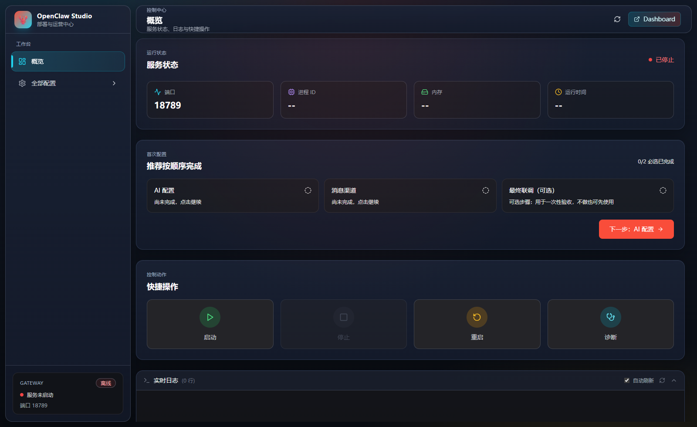
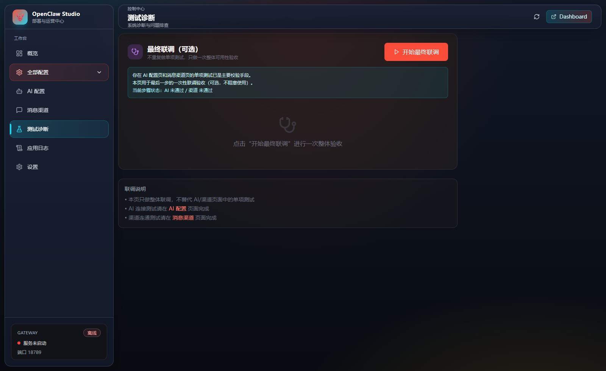

# OpenClaw Studio

面向中文用户的 OpenClaw 图形化安装与管理工具。  
基于 `Tauri 2 + React + TypeScript + Rust`，重点解决「一键安装、可视化配置、可诊断修复」。

## 界面截图

### 概览工作台



### 最终联调



## 项目定位

本项目不是通用模板，而是当前这套可交付产品：

- 安装优先：首次打开先做环境检测与自动安装（Node.js / OpenClaw）
- 中文引导：配置步骤、错误提示、修复建议都以中文呈现
- 中国区适配：AI 与渠道配置优先推荐中国区常用方案
- 工作台闭环：AI 配置 -> 消息渠道 -> 最终联调（可选）

## 当前核心功能

### 1) 安装与修复流程

- 自动检测环境（Node、OpenClaw、配置状态）
- 一键修复并安装缺失依赖
- Node 安装支持普通/管理员策略与自动回退
- 安装失败支持诊断报告与可执行修复建议

### 2) 工作台与引导

- 安装完成后进入 OpenClaw Studio 工作台
- 概览页提供首次配置任务卡
- 必选步骤：`AI 配置`、`消息渠道`
- 可选步骤：`最终联调`（一次性整体验收）

### 3) AI 配置（中国区优先）

- 优先展示中国区常用 Provider
- 支持 DeepSeek / Qwen / GLM / Kimi / MiniMax 等
- DeepSeek 默认与自动修正为 `https://api.deepseek.com/v1`
- 主模型选择与连接测试可视化

### 4) 渠道配置与测试

- 渠道配置页内置字段获取提示（去哪拿、怎么填）
- 支持飞书等渠道快速测试
- 对常见错误（如飞书 230006）提供中文操作指引

## 安装使用（面向用户）

在发布产物中可直接使用安装包（Windows）：

- `OpenClaw Studio_x64-setup.exe`（NSIS）
- `OpenClaw Studio_x64_en-US.msi`（MSI）

安装后按界面引导完成配置即可。

## 本地开发

### 环境要求

- Node.js 22+
- Rust 1.70+
- Windows 构建需要 Visual Studio C++ Build Tools

### 启动与构建

```bash
# 安装依赖
npm install

# 开发模式
npm run tauri:dev

# 生产打包
npm run tauri:build
```

## 项目结构（关键目录）

```text
openclaw-manager/
├─ src/                          # 前端（工作台、配置页、安装引导）
│  ├─ App.tsx
│  └─ components/
│     ├─ Setup/                 # 安装与修复流程
│     ├─ Dashboard/             # 概览与任务引导
│     ├─ AIConfig/              # AI 配置
│     ├─ Channels/              # 渠道配置
│     └─ Testing/               # 最终联调
└─ src-tauri/                   # Rust 后端命令与打包
   ├─ src/commands/
   │  ├─ installer.rs           # 安装、修复、诊断
   │  ├─ config.rs              # AI/渠道配置读写
   │  └─ diagnostics.rs         # 测试与错误解析
   └─ tauri.conf.json
```

## 说明

- 本项目持续迭代中，README 以当前产品形态为准。
- 如需反馈安装/配置问题，请附上界面日志与错误码，便于快速定位。
